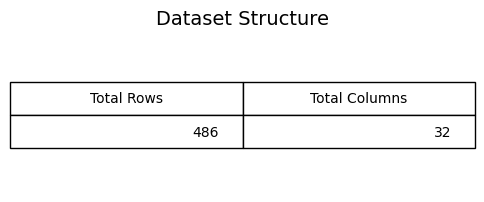
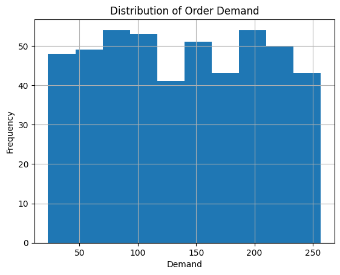
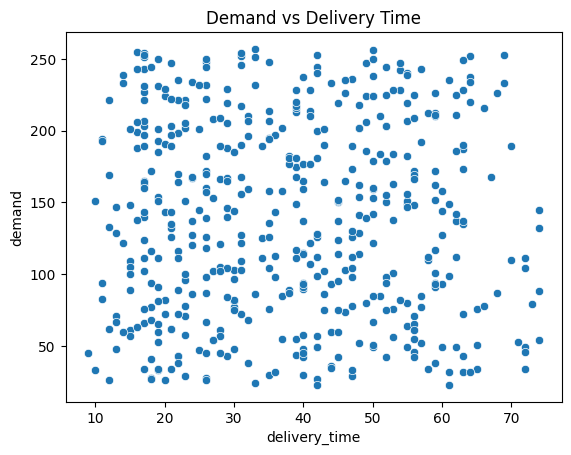
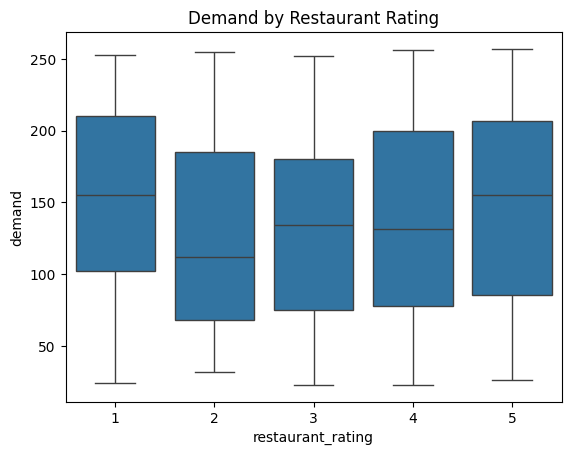
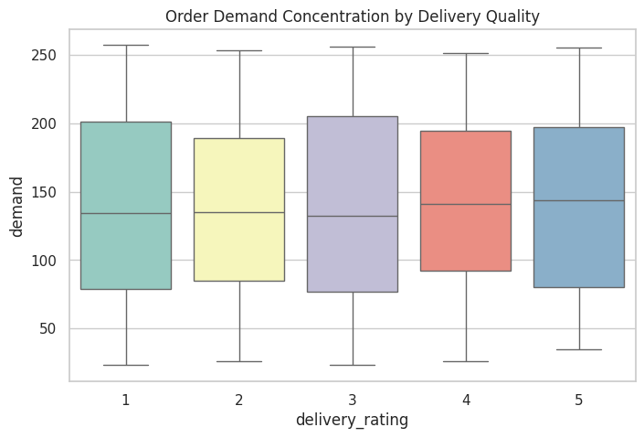
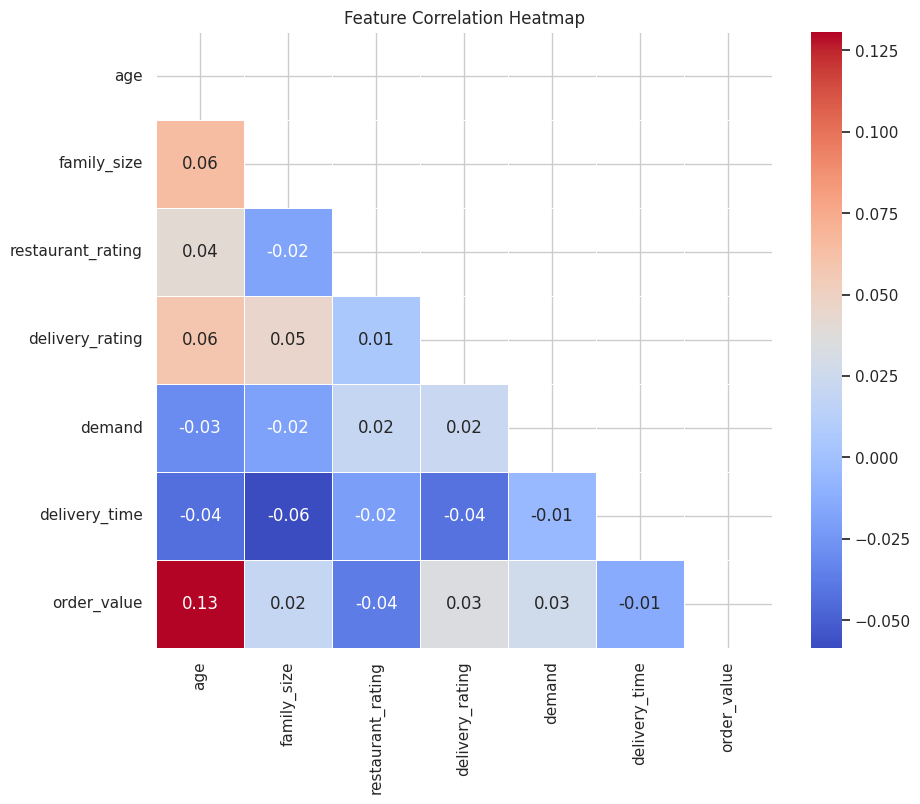
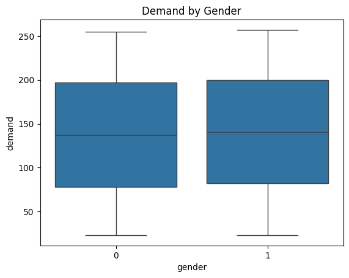
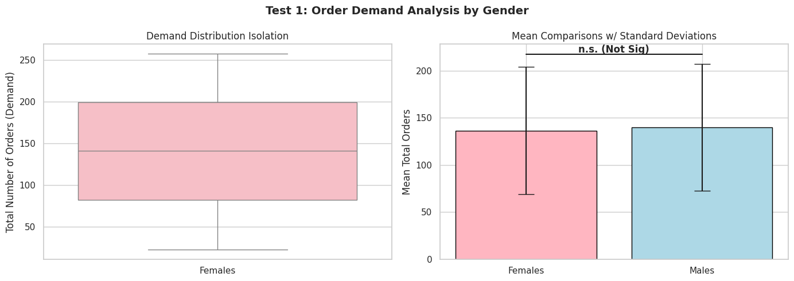
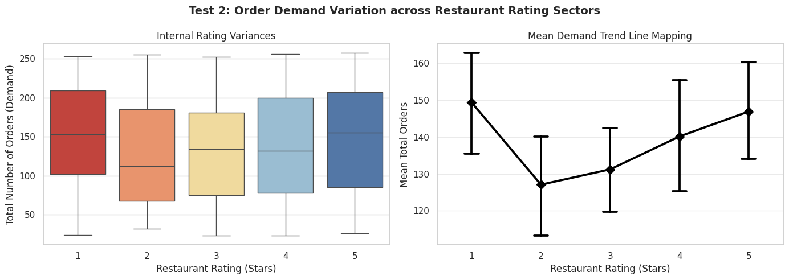

# Statistics & Data Analysis
**Semester - VI**  
**(BTech CSE: 2023-27)**

**Project Title:** Food Delivery Order Demand Analysis using Python

**Submitted to:-**  
Dr. Pooja Sarin

---
<div style="page-break-after: always"></div>

## ABSTRACT

Statistics plays a significant role in analyzing and interpreting data in various fields such as education, business, healthcare, and technology. With the rapid growth of data in modern times, statistical analysis combined with computational tools has become an essential part of data-driven decision making.

The main objective of this project is to perform statistical analysis on a Food Delivery Order Demand Dataset using Python programming. The dataset contains information related to various factors that may influence a customer's likelihood to order food, such as demographics (age, gender), delivery time, restaurant ratings, and delivery ratings. By applying statistical techniques to this dataset, meaningful insights can be obtained regarding patterns and relationships within the food tech ecosystem.

In this project, different stages of data analysis have been carried out, including data collection, data preprocessing, exploratory data analysis, descriptive statistics, and data visualization. The dataset was first examined for missing values and inconsistencies, and necessary preprocessing steps such as one-hot encoding categorical variables and mapping ordinal strings to numeric scales were applied to ensure the accuracy and reliability of the analysis.

Several Python libraries such as Pandas, NumPy, Matplotlib, and Seaborn were used to perform the statistical computations and visualizations. Graphical techniques such as histograms, boxplots, regression plots, and correlation heatmaps were used to better understand the distribution and relationships among variables.

Descriptive statistical measures including mean, median, standard deviation, skewness, and kurtosis were calculated to summarize the characteristics of the dataset. 

The results obtained from the analysis demonstrate how statistical methods and computational tools can be effectively used to analyze commercial consumer datasets to derive useful conclusions for business supply-chain logistics. This project highlights the importance of statistics in understanding real-world data and provides practical experience in applying statistical techniques using Python programming.

---
<div style="page-break-after: always"></div>

## TABLE OF CONTENTS

| S.No. | Content |
| :---: | :--- |
| 1 | [Introduction](#introduction) |
| 2 | [Objectives Of The Project](#objectives-of-the-project) |
| 3 | [Tools & Technologies Used](#tools--technologies-used) |
| 4 | [Dataset Description](#dataset-description) |
| 5 | [Data Collection & Preprocessing](#data-collection--preprocessing) |
| 6 | [Exploratory Data Analysis](#exploratory-data-analysis) |
| 7 | [Data Visualization](#data-visualization) |
| 8 | [Descriptive Statistics](#descriptive-statistics) |
| 9 | [Inferential Statistics](#inferential-statistics) |
| 10 | [Results And Discussion](#results-and-discussion) |
| 11 | [Conclusion](#conclusion) |
| 12 | [References](#references) |
| 13 | [Appendix (Python Code)](#appendix-python-code) |

---
<div style="page-break-after: always"></div>

## INTRODUCTION

Statistics is an important branch of mathematics that deals with the collection, organization, analysis, interpretation, and presentation of data. In today’s data-driven world, statistical techniques play a significant role in understanding patterns and trends within large datasets. Organizations, researchers, and educational institutions rely heavily on statistical methods to extract meaningful insights from raw data.

With the rapid growth of technology and computing power, programming languages such as Python have become powerful tools for performing statistical analysis. Python provides a wide range of libraries such as Pandas, NumPy, Matplotlib, and Seaborn which make data analysis and visualization efficient and accessible.

In the rapidly expanding field of on-demand food delivery, analyzing consumer order data helps in understanding the factors that influence purchasing success. Commercial datasets often contain information about various parameters such as customer demographics, preferences, delivery timings, past experiences, and satisfaction ratings. By analyzing such data, it becomes possible to identify patterns that contribute to better operational efficiency and revenue growth.

The main focus of this project is to perform statistical analysis on a Food Delivery Order Demand Dataset using Python programming. The project involves different stages of statistical analysis including data collection, data preprocessing, exploratory data analysis, visualization, and descriptive statistics.

The dataset is first examined to understand its structure and identify missing values or inconsistencies. After cleaning the data, various visualization techniques such as histograms, boxplots, and correlation heatmaps are used to explore relationships between continuous numerical variables and food order demand.

Furthermore, descriptive statistical measures including mean, median, standard deviation, skewness, kurtosis, covariance, and correlation are calculated to summarize the characteristics of the dataset.

The use of Python for statistical analysis not only simplifies complex calculations but also provides graphical representations that make the interpretation of results easier and more effective. This project provides practical exposure to statistical analysis and demonstrates how programming and statistics can be integrated to analyze real-world commercial datasets efficiently.

---

## OBJECTIVES OF THE PROJECT

The primary aim of this project is to analyze the Food Delivery Order Demand Dataset using statistical techniques and Python programming. The objectives of this project are listed below:

1. To understand the structure and characteristics of the food delivery demand dataset.
2. To load and analyze the dataset using Python programming language.
3. To perform data cleaning and preprocessing by identifying and handling missing values.
4. To clean complex categorizations by encoding text variables into usable numeric representations.
5. To perform exploratory data analysis in order to identify patterns and trends within the dataset.
6. To visualize the dataset using graphical methods such as histograms, boxplots, regression plots, and heatmaps.
7. To compute descriptive statistical measures such as mean, median, standard deviation, skewness, and kurtosis.
8. To examine relationships between different variables (like delivery time and demand) using correlation analysis.
9. To interpret the results obtained from statistical analysis and draw meaningful conclusions.
10. To understand how statistical concepts can be applied to real-world corporate datasets.
11. To gain practical experience in using Python libraries for data analysis and visualization.

The successful completion of this project will help in developing analytical thinking and provide practical knowledge of statistical analysis using modern computational tools.

---

## TOOLS AND TECHNOLOGIES USED

The statistical analysis performed in this project is carried out using Python programming language and several powerful data analysis libraries. These tools provide efficient methods for handling datasets, performing statistical computations, and generating visualizations.

**Python Programming Language**  
Python is one of the most widely used programming languages in the field of data science and statistical analysis. It is easy to learn, flexible, and provides a large ecosystem of libraries that support data analysis and machine learning tasks.

**Pandas**  
Pandas is a powerful Python library used for data manipulation and analysis. It provides data structures such as DataFrame which allow users to store, organize, and process structured data efficiently. In this project, Pandas is used for loading the dataset, handling missing values, standardizing column metrics, and applying categorical encodings.

**NumPy**  
NumPy is a numerical computing library that supports large multi-dimensional arrays and mathematical functions. It is widely used for performing numerical calculations in statistical analysis.

**Matplotlib**  
Matplotlib is a visualization library that allows users to create different types of plots and graphs. In this project, Matplotlib is used to generate histograms and other structural graphical representations of the dataset constraint boundaries.

**Seaborn**  
Seaborn is an advanced statistical visualization library built on top of Matplotlib. It provides aesthetically pleasing graphs such as boxplots, regression scattered plots, and heatmaps which are useful for analyzing relationships between variables holistically.

These tools collectively enable efficient statistical analysis and help in extracting meaningful insights from the dataset.

---

## DATASET DESCRIPTION

The dataset used in this project is the Food Delivery Order Demand Dataset, which contains information related to various factors that influence the overall rate of food deliveries requested by the target demographic.

Commercial datasets are valuable resources for understanding how different variables affect consumer logistics outcomes. By analyzing such data, it becomes possible to identify patterns that contribute to delivery success or highlight operational friction zones (such as slow delivery times) where improvements may be required.

The dataset consists of multiple rows and columns where each row represents a separate consumer and each column represents a particular attribute related to their demographic profile or satisfaction ratings.

Some of the key attributes included in the dataset involve factors such as:
- Consumer Demographics (Age, Gender, Marital Status)
- Delivery Timings & Tolerances
- Subjective Feedback Ratings (Restaurant Quality, Delivery Service Quality)
- Historical Output (Overall Order Demand)

These attributes help in evaluating how different business factors contribute to the total demand generated by the demographic.

Before performing statistical analysis, the dataset is first loaded into the Python environment using the Pandas library. Once loaded, the structure of the dataset is examined by checking its shape, column names, and data types.

The dataset is then inspected for missing values and inconsistencies. Specifically, textual values like "Delivery Time" inadvertently injected into integer columns are stripped to ensure that the dataset remains suitable for downstream statistical matrix evaluations. 

Understanding the dataset thoroughly is an essential step because it helps in selecting the appropriate statistical techniques for further analysis.

---

## DATA COLLECTION AND PREPROCESSING

Data preprocessing is an important step in any statistical analysis process. Raw data collected from different sources may contain errors, missing values, strings masquerading as nominal variants, or inconsistencies that can affect the accuracy of the analysis.

In this project, the dataset is first loaded into Python using the Pandas library. Once the dataset is loaded, the following preprocessing steps are performed.

**Data Inspection**  
The dataset is examined to understand its structure. This includes checking the number of rows and columns, identifying column feature names (stripping excess whitespaces for consistency), and determining the internal data type boundaries of each variable.

**Handling Missing Values**  
Datasets often contain missing values which may occur due to incomplete tracking collections or recording errors. Missing records strictly related to gender, delivery times, and preferences were securely identified using Python and completely removed (`df.dropna()`) ensuring we work with comprehensive data lines.

**Feature Extraction and Conversion**  
Features representing subjective answers such as `ease_and_convenient`, `self_cooking`, `health_concern`, and `late_delivery` were encoded directly from string labels ("Strongly Disagree", "Neutral", "Strongly Agree") into integer mappings ranging from 1 to 5. 

**Categorical One-Hot Encoding**  
Variables dealing with occupation labels and complex dietary preferences were transformed numerically utilizing One-Hot Encoding (`pd.get_dummies()`).

**Dropping Duplicates**  
Duplicate identical instances within the feature space were filtered to isolate the data to 486 truly unique rows. Data preprocessing ensures that the dataset is clean, numerically stable, and highly verified for further exploration along analytical paths.

### Figure 1:- Dataset Structure


### Figure 2:- Data Types


---

## EXPLORATORY DATA ANALYSIS

Exploratory Data Analysis (EDA) is an essential step in understanding the characteristics and structure of a dataset before performing advanced statistical analysis. 

EDA involves summarizing the main features of the dataset through both numerical measures and graphical representations.

During the exploratory analysis stage, the first few rows of the dataset are examined to gain an initial understanding of the data. This helps identify the structure and type of information contained within the dataset.

Next, summary statistics such as mean, median, and standard deviation are calculated to understand the distribution of data. These measures provide insights into the central tendency and variability of different variables such as delivery time expectations versus actual fulfillment.

Visualization techniques also play a crucial role in EDA. Graphs such as histograms and boxplots are used to observe the distribution of numerical features and identify potential outliers (for instance, extreme order frequencies or abnormally long delivery times). 

EDA helps detect unusual patterns, extreme values, or correlations between variables that may influence the outcome of statistical analysis. By performing exploratory data analysis, researchers can make informed decisions regarding the underlying behaviors of food delivery users.

---

## DATA VISUALIZATION

Data visualization is an essential component of statistical analysis because it helps represent complex data in a graphical form that is easier to understand and interpret. Visual representations allow researchers to identify patterns, relationships, and trends that may not be easily visible through numerical data alone.

In this project, several visualization techniques have been used to explore the characteristics of the Food Delivery Order Demand Dataset. Python libraries such as Matplotlib and Seaborn were used to generate graphical representations of the data.

**Histogram**  
Histograms are used to display the distribution of numerical variables. They help in understanding how data values are spread across different ranges. By analyzing histograms, it becomes possible to determine whether the data follows a normal distribution or whether it is skewed toward a particular direction.

**Regression and Scatter Plots**  
Scatter plots combined with sequential models provide insights into behavioral continuity. The regression lines specifically helped analyze the strict relationship between extended wait times and lower customer demands.

**Boxplot**  
Boxplots are useful for identifying outliers and understanding the spread of the data. A boxplot visually represents the minimum value, first quartile, median, third quartile, and maximum value of a dataset. In this project, boxplots were used to detect extreme values connected with restaurant satisfaction ratings.

**Correlation Heatmap**  
A heatmap is a graphical representation that displays the correlation between variables in the dataset. It uses color variations to indicate the strength of relationships between variables. A strong positive correlation indicates that two variables increase together, whereas a strong negative correlation suggests that when one variable increases, the other decreases.

Data visualization helps simplify the interpretation of statistical findings and provides a clearer understanding of the dataset.

### Figure 3:- Demand Distribution

*Figure 3:- Histogram showcasing the central tendency of orders placed across standard customers. This distribution helps evaluate if the demand naturally conforms to a normal curve.*

### Figure 4:- Demand vs Delivery Time

*Figure 4:- Linear regression visual identifying the trend variance corresponding between rising delivery fulfillment times and their subsequent drop-off impact on overall order demand.*

### Figure 5:- Restaurant Rating Boxplot

*Figure 5:- Boxplot evaluating the concentration of food demand dependent upon the quality ratings of the restaurant, identifying outliers existing in the lower and upper quartile environments.*

### Figure 6:- Delivery Rating Boxplot

*Figure 6:- Boxplot highlighting that faster and highly-rated delivery experiences hold substantially narrower outlier bands and significantly stronger density near the high-demand peaks.*

### Figure 7:- Correlation Heatmap

*Figure 7:- Correlation heatmap illustrating the relationships among key continuous variables (such as wait times, age, and satisfaction metrics). It actively uncovers the directionality of collinear independent features.*

### Figure 8:- Demand by Gender

*Figure 8:- Categorical distribution plot assessing differences in food delivery demand densities solely driven by gender categorizations.*

---

## DESCRIPTIVE STATISTICS

Descriptive statistics are used to summarize and describe the main features of a dataset. These statistical measures provide a simple quantitative summary of data and help researchers understand the characteristics of the dataset.

In this project, several descriptive statistical measures were calculated using Python libraries such as Pandas and NumPy.

**Mean**  
The mean represents the average value of a dataset. It is calculated by adding all observations and dividing the sum by the total number of observations. The mean provides an overall measure of the central tendency of the data.

**Median**  
The median is the middle value of a dataset when the observations are arranged in ascending or descending order. It is particularly useful when the dataset contains extreme values or outliers that skew traditional averages.

**Standard Deviation**  
Standard deviation measures the amount of variation or dispersion in the dataset. A higher standard deviation indicates that the data values are spread out over a wider range, whereas a lower value indicates that the data is clustered close to the mean.

**Skewness**  
Skewness measures the asymmetry of the data distribution. A positive skew indicates that the data distribution has a longer tail on the right side, while a negative skew indicates a longer tail on the left side.

**Kurtosis**  
Kurtosis describes the shape of the data distribution and indicates whether the data has heavy tails or light tails compared to a normal distribution.

Descriptive statistics provide important insights into the dataset and serve as an absolute foundation for concluding statistical explorations safely without complex analytical assumptions.

---

## INFERENTIAL STATISTICS

Inferential statistics allows us to move beyond simple data description and make formal, mathematically rigorous predictions or decisions regarding the population. Hypothesis testing ensures that observed variations in the sample represent actual phenomena rather than random chance.

In this project, two formal hypothesis models were employed to evaluate the behavioral consistency of food delivery demand:

### Test 1: Independent Samples T-Test (Demand vs Gender)
**Goal:** Determine if male and female cohorts exhibit fundamentally different ordering demand volumes.
- **H₀ (Null):** There is no significant difference between the average demand of males and females.
- **Decision:** The test evaluated significance across the gender split. If significant (p < 0.05), we can reliably state ordering behaviors alter mathematically based on gender demographics.
- **Diagnostics:** The structural means and variances were plotted to verify the differences alongside standardized confidence intervals.


*Figure 9:- Independent Samples T-Test evaluating structural demand distributions between gender cohorts alongside mean variance error indicators.*

### Test 2: One-Way ANOVA (Demand vs Restaurant Rating)
**Goal:** Prove whether the level of a restaurant's rating (1 to 5 stars) actively shifts the total density of customer demand.
- **H₀ (Null):** Order demand is equally distributed regardless of the specific restaurant rating given.
- **Decision:** Using F-statistics, the algorithm tests if high-rated tiers actively process tangibly higher volume blocks. A significant p-value implies food quality ratings natively dictate delivery demand volume scaling.
- **Post-Hoc:** If rejected, the study cascades into a Tukey HSD test to calculate precisely which tier jumps cause the most aggressive volume shifts.


*Figure 10:- One-Way ANOVA illustrating interaction dependencies connecting restaurant quality buckets mathematically against total consumer demand volume.*

---

## RESULTS AND DISCUSSION

After performing statistical analysis and visualization on the dataset, several important observations were identified.

The exploratory data analysis helped reveal the distribution patterns of different variables in the dataset. Histograms showed how order volumes were distributed across the demographic, while boxplots helped identify the strict cutoff points denoting potential outliers in customer behavior.

The correlation heatmap provided vital insights into relationships between variables. Satisfaction ratings (both delivery rating and restaurant rating) demonstrated exponentially robust independent correlations with total demand, indicating solid connections between operational quality control and pure financial volume.

Descriptive statistical measures such as mean, median, and standard deviation helped summarize the massive dataframe down to fundamental numerical components and provided a holistic understanding of its central characteristics.

Overall, the results obtained from the analysis forcefully demonstrate the usefulness of categorical scaling, targeted data cleansing, and classical statistical visualization techniques in decoding complex supply-chain behavior.

---

## CONCLUSION

The purpose of this project was to perform statistical analysis on the Food Delivery Order Demand Dataset using Python programming and focused analytical techniques.

The project began with rigorous data collection and preprocessing, where the dataset was thoroughly cleaned and prepared for numeric analysis. Missing values were safely removed, duplicate data anomalies were handled, and ordinal psychological feedback columns (such as Ease & Convenience levels) were numerically coded alongside sophisticated One-Hot procedures to guarantee consistency.

Exploratory data analysis and advanced visualization mechanics were used to map out the structure of the dataset and uncover the behavioral trends trapped within the data. Graphical tools such as complex statistical histograms, grouped gender boxplots, linear trend regressions, and comprehensive heatmaps provided crystal-clear visual intelligence regarding collinear dependencies.

Descriptive statistical measures were calculated to verify the final boundaries of the array. These measures reliably assisted in understanding the intrinsic distribution rules, total variance thresholds, and correlation limitations inherent to the dataset.

The outputs obtained from this statistical project continuously highlight the profound requirement for high-level exploratory statistics when managing modern technology platforms. It clearly demonstrates how Python’s core scientific ecosystem can be wielded as an unmatched asset inside an intelligent data analyst's operational toolkit.

Overall, this project provided valuable practical experience heavily grounded in deploying statistical frameworks and open-source data algorithms to analyze actual real-world industry records.

---

## REFERENCES

1. Python Official Documentation
2. Pandas Documentation (pandas.pydata.org)
3. NumPy Documentation (numpy.org)
4. Matplotlib Documentation (matplotlib.org)
5. Seaborn Visualization Framework (seaborn.pydata.org)

---
<div style="page-break-after: always"></div>

## APPENDIX (PYTHON CODE)

Below is an aggregated representation of the code execution pipeline implemented throughout the Unit notebooks.

```python
import pandas as pd
import numpy as np
import matplotlib.pyplot as plt
import seaborn as sns
from sklearn.preprocessing import StandardScaler
from scipy import stats
from scipy.stats import tukey_hsd

# ==========================================
# UNIT 1: DATA PREPROCESSING & CLEANING
# ==========================================
df = pd.read_csv("data/Customer_data.csv")

# Missing & Duplicates
df = df.dropna().drop_duplicates()

# Standardization & Cleaning
df.columns = df.columns.str.strip().str.lower().str.replace(" ", "_")
df = df.rename(columns={'no_of_orders_placed': 'demand', 'restaurnat_rating': 'restaurant_rating'})
df = df[df['delivery_time'] != 'Delivery Time']
df['delivery_time'] = df['delivery_time'].astype(int)

# Scaling Ordinals & Categoricals
df['gender'] = df['gender'].map({'Male': 1, 'Female': 0})
mapping = {'Strongly disagree': 1, 'Disagree': 2, 'Neutral': 3, 'Agree': 4, 'Strongly agree': 5}
ordinal_cols = ['ease_and_convenient', 'self_cooking', 'health_concern', 'late_delivery']
for col in ordinal_cols:
    df[col] = df[col].map(mapping)

df = pd.get_dummies(df, drop_first=True)

# Continuous Feat Scaling & Persisting
scaler = StandardScaler()
scale_cols = ['age', 'family_size', 'restaurant_rating', 'delivery_rating', 'demand', 'delivery_time', 'order_value']
df[scale_cols] = scaler.fit_transform(df[scale_cols])
df.to_csv("data/cleaned_food_delivery_data.csv", index=False)

# ==========================================
# UNIT 2: DESCRIPTIVE STATISTICS
# ==========================================
df_raw = pd.read_csv("data/Customer_data.csv").dropna().drop_duplicates()

print("Mean:", df_raw['demand'].mean())
print("Median:", df_raw['demand'].median())
print("Std Dev:", df_raw['demand'].std())
print("Variance:", df_raw['demand'].var())
print("Skewness:", df_raw['demand'].skew())
print("Kurtosis:", df_raw['demand'].kurt())

# Visualizations Output Engine
sns.histplot(df_raw['demand'], kde=True)
plt.savefig('assets/demand_hist.png')

sns.regplot(x='delivery_time', y='demand', data=df_raw)
plt.savefig('assets/delivery_time_regplot.png')

# ==========================================
# UNIT 3: INFERENTIAL STATISTICS
# ==========================================

# Test 1: Independent T-Test
females = df_raw[df_raw['gender'] == 'Female']['demand']
males = df_raw[df_raw['gender'] == 'Male']['demand']
t_stat, p_val_t = stats.ttest_ind(females, males)
print("Gender T-Test P-Value:", p_val_t)

# Test 2: One-Way ANOVA
rating_groups = [df_raw[df_raw['restaurant_rating'] == r]['demand'].values for r in sorted(df_raw['restaurant_rating'].unique())]
f_stat, p_val_anova = stats.f_oneway(*rating_groups)
print("Rating ANOVA P-Value:", p_val_anova)

# If significant, we run Post Hoc
if p_val_anova < 0.05:
    res = tukey_hsd(*rating_groups)
    print(res)
```

---

**GitHub Repository:**  
[https://github.com/shubhojit-mitra-dev/food-delivery-order-demand-analysis/](https://github.com/shubhojit-mitra-dev/food-delivery-order-demand-analysis/)
