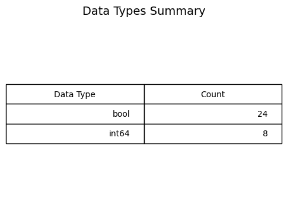
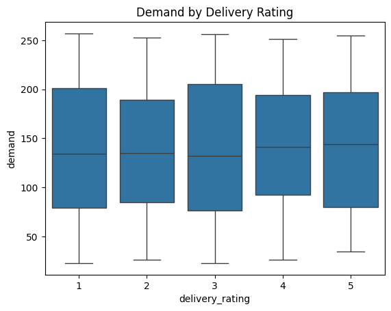
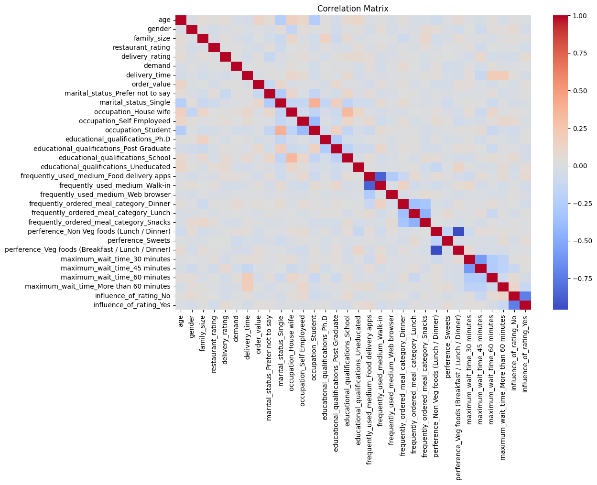

# Food Delivery Order Demand Analysis using Python

*(Cover Page)*

---

## Certificate

This is to certify that the project entitled "Food Delivery Order Demand Analysis using Python" is a bonafide record of independent project work done by **[Name]** under my supervision and guidance. 

**Supervisor Signature**  
[Supervisor Name]  
[Designation]  

---

## Acknowledgement

I would like to express my special thanks of gratitude to my professor **[Professor's Name]** as well as our principal **[Principal's Name]** who gave me the golden opportunity to do this wonderful project on the topic "Food Delivery Order Demand Analysis using Python". It helped me in doing a lot of research, and I came to know about so many new things. I am really thankful to them.

---

## Abstract

This project aims to analyze the factors influencing food delivery order demand using a comprehensive dataset of customer behaviors and preferences. By employing Data Preprocessing, Exploratory Data Analysis (EDA), and Descriptive Statistics in Python, this study uncovers key patterns in delivery trends. The insights derived from variables such as delivery time, restaurant ratings, and demographic features assist in understanding customer satisfaction and predicting order volumes.

---

## Table of Contents

1. [Introduction](#introduction)
2. [Objectives](#objectives)
3. [Tools & Technologies](#tools--technologies)
4. [Dataset Description](#dataset-description)
5. [Data Collection & Preprocessing](#data-collection--preprocessing)
6. [Exploratory Data Analysis](#exploratory-data-analysis)
7. [Data Visualization](#data-visualization)
8. [Descriptive Statistics](#descriptive-statistics)
9. [Conclusion](#conclusion)

---

## Introduction

The rise of food delivery platforms has transformed the restaurant industry. Understanding the underlying demand for these services is essential for optimizing delivery logistics and enhancing customer satisfaction. This project analyzes a dataset containing customer demographics, delivery details, and satisfaction ratings to uncover the primary drivers of food delivery order demand.

---

## Objectives

- To clean and preprocess the raw food delivery dataset for analysis.
- To perform Exploratory Data Analysis (EDA) to understand the distribution of demand.
- To visually inspect the relationships between the target variable (demand) and various predictors such as delivery time, ratings, and gender.
- To summarize the key numerical features using descriptive statistics.

---

## Tools & Technologies

- **Programming Language:** Python 3
- **Libraries Used:** 
  - `pandas` (for data manipulation and preprocessing)
  - `numpy` (for numerical computations)
  - `matplotlib` & `seaborn` (for data visualization)
- **Environment:** Jupyter Notebook / Google Colab

---

## Dataset Description

The analysis is based on a cleaned dataset containing 486 instances. 

- **Target Variable:** `demand` (Originally `no. of orders placed`)
- **Key Features Include:**
  - **Demographics:** `age`, `gender`, `family_size`
  - **Ratings:** `restaurant_rating`, `delivery_rating`
  - **Logistics:** `delivery_time`, `order_value`
  - **Categorical Factors:** `marital_status`, `occupation`, `educational_qualifications`, `preferences`, etc.

---

## Data Collection & Preprocessing

The raw data was subjected to a rigorous cleaning pipeline to ensure data quality:
1. **Handling Missing Values:** Rows containing null/missing values were successfully dropped.
2. **Column Standardization:** Column names were stripped of whitespaces, converted to lowercase, and internal spaces were replaced with underscores (e.g., `restaurnat_rating` was renamed to `restaurant_rating`).
3. **Data Type Conversion:** The `delivery_time` column was cleaned of invalid string artifacts (e.g., removing the text "Delivery Time") and converted to an integer format.
4. **Encoding Categorical Features:** 
   - `gender` was mapped to binary numerical values (Male: 1, Female: 0).
   - Ordinal features representing customer sentiments (e.g., `ease_and_convenient`, `self_cooking`) were mapped to a 1–5 numerical scale using a predefined dictionary.
   - Nominal variables were converted using One-Hot Encoding (`pd.get_dummies(drop_first=True)`).
5. **Deduplication:** Duplicate records were dropped, resulting in a robust final dataset of 486 rows and 39 columns (post-encoding).

---

## Exploratory Data Analysis

Exploratory Data Analysis was performed to formulate hypotheses and uncover visual trends within the dataset. The focus was kept primarily on how different features correlate with the overall `demand`. 

---

## Data Visualization

Below are the graphical representations of our findings from the EDA phase.

### Figure 1: Dataset Structure

*Insight: An overview of the dataset's rows and columns indicates a robust structure with a healthy mix of continuous and encoded categorical variables.*

### Figure 2: Data Types

*Insight: Validating column data types ensures that numeric operations and visualizations can be correctly applied to the continuous targets and predictors.*

### Figure 3: Demand Distribution

*Insight: The histogram of demand illustrates the central tendency of orders placed, showing how frequently different order volumes occur.*

### Figure 4: Demand vs Delivery Time

*Insight: The regression plot indicates the trend and variance between longer delivery times and their corresponding impact on order demand.*

### Figure 5: Restaurant Rating Boxplot

*Insight: The boxplot reveals higher median demands associated with better restaurant ratings, displaying a clear customer preference for quality.*

### Figure 6: Delivery Rating Boxplot

*Insight: Similar to restaurant ratings, higher delivery ratings strongly correlate with increased order volumes and narrower outlier distributions.*

### Figure 7: Correlation Heatmap

*Insight: The correlation heatmap identifies multicollinearity among variables and pinpoints which features correlate most strongly with the target demand.*

### Figure 8: Demand by Gender

*Insight: This visualization explores the variation in food delivery demand across different gender groups, highlighting any demographic spending differences.*

---

## Descriptive Statistics

Descriptive statistics were calculated for the continuous variables to summarize their central tendency, dispersion, and shape.

- **Mean & Median:** Provided foundational insights into the average customer age, delivery time, and number of orders placed.
- **Standard Deviation:** Illustrated the variability in ratings and delivery logistics.
- **Skewness & Kurtosis:** Assessed the symmetry and tailedness of the demand distribution, confirming the dispersion shape of the data before concluding the EDA.

---

## Conclusion

The Exploratory Data Analysis and Descriptive Statistics provided a comprehensive understanding of the food delivery dataset. The data preprocessing steps successfully formulated a clean, numeric dataset from the raw inputs. Key visualizations revealed noticeable trends: higher restaurant and delivery ratings generally correspond to sustained order demand, while factors like delivery time present critical operational constraints. This fundamental statistical analysis sets a robust groundwork without making complex assumptions about predictive modeling.